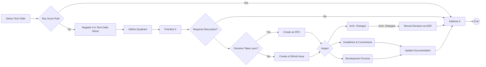

# How we manage tech debt

## 1. Introduction

Managing technical debt is essential to maintaining code quality and ensuring smooth project delivery. This RFC defines a structured process to ensure that technical debt is identified, tracked, discussed, and addressed within the team. The process aims to ensure transparency, accountability, and consistent prioritization of technical debt.

## 2. Problem Statement

Technical debt, if left unaddressed, can hinder future development and introduce risks to the codebase. Currently, the team lacks a formalized process for handling technical debt, leading to ad-hoc decisions and untracked progress. This RFC proposes a clear process to identify, document, discuss, and resolve technical debt issues in a manageable and efficient manner.

## 3. Proposed Solution

### 3.1 Technical Debt Registration Process

#### Register in the Tech Debt Sheet

Any team member identifying technical debt must log it in the "Tech Debt Sheet" if it is not registered. This sheet serves as the central place to track all technical debt.

**Owner**: The person identifying the technical debt must register it in the sheet.

**Requirement**: If technical debt is not registered in the Tech Debt Sheet, any discussion or actions regarding it will not be considered valid or actionable. This rule ensures that all debt is tracked and prioritized appropriately.

**Exceptions**: Addressing an improvement that is considered a Boy Scout rule can be tackled by skipping the process but the impact cannot generate divergences on the application and the scope MUST be restricted to the current PR.

#### Define the Quadrant

When logging technical debt, classify it into one of the following quadrants based on Effort (how much work is required to resolve the debt) and Impact (the potential benefit or harm to the project if addressed or ignored). This quadrant system helps the team focus on high-impact, manageable debts while avoiding resource drains.

**Big Bets**: High effort, high impact. These are large, complex debts that require significant resources but can bring substantial benefits if resolved. Prioritize these carefully and ensure they align with broader project goals.

**Easy Wins**: Low effort, high impact. These debts are relatively easy to resolve and offer a significant improvement to the project. Address these as quickly as possible to maximize impact with minimal effort.

**Incremental**: Low effort, low impact. These debts are minor issues that don’t greatly affect the project but can be resolved with minimal effort. Tackle them when time allows, or bundle them with other tasks.

**Money Pit**: High effort, low impact. These debts require a lot of work but offer little benefit. Avoid spending too many resources on these unless they become critical over time.

### 3.2 Prioritization

Once the technical debt is registered and categorized into a quadrant, a dedicated **Tech Debt Review Meeting** should be held regularly (e.g., bi-weekly or monthly) to:

**Discuss New Discoveries**: Team members present any newly identified technical debt logged in the “Tech Debt Sheet.” The goal is to ensure that all debts are understood, clearly described, and registered with enough detail for discussion.

**Review and Adjust Quadrants**: For previously registered debts, reassess their assigned quadrant. Over time, the impact or effort associated with a technical debt item might change, requiring a shift to a different quadrant. For example, a low-effort debt may evolve into a more complex issue, or a low-impact debt may become critical.

**Prioritize for following Sprints**: Based on the updated quadrants and team capacity, decide which technical debt items should be prioritized for the upcoming sprint. Focus on addressing Quadrant 2 (Easy Wins) first, while also strategically considering Quadrant 1 (Big Bets) that align with broader goals. Avoid tackling Quadrant 4 (Money Pit) unless absolutely necessary.

**Evaluate the Need for a Decision**: Identify if any technical debt items require more in-depth discussion to determine the best approach for resolution. If the solution is unclear or has significant implications, a decision-making process should be initiated.

### 3.3 Solution Review & Decision Process

After the tech debt has been prioritized, the team should review if further discussions are needed to define the appropriate solution for specific technical debt items.

#### Assess Decision Complexity

Based on the complexity of the technical debt, evaluate how challenging it will be to reach a decision. This helps determine the most efficient approach for the team to collaborate and finalize the solution:

* Simple Decision (Low Complexity): If the solution is relatively straightforward, a GitHub issue can be created to handle the discussion asynchronously. The team can contribute thoughts and suggestions, and the discussion can conclude online.

* Complex Decision (High Complexity): If the technical debt involves multiple trade-offs, uncertainty, or has broader project implications, it may require a scheduled meeting to discuss the solution in more detail followed by more detailed Github issue discussions to make sure that everyone is aligned.

This discussion ensures the team is aligned on the severity of the debt and how to address it.

#### Document the Final Decision

Once a solution is agreed upon, whether via a meeting or an async discussion, it should be formalized by recording it as an ADR (Architecture Decision Record). The ADR will document the context, reasoning, and the chosen resolution path, ensuring that the decision is transparent and traceable for future reference.

* **Problem and Context**: A detailed explanation of the technical debt and why it needs resolution.
* **Resolution Plan**: Concrete steps or strategies to resolve the debt.
* **Impact**: The effect on the codebase, team processes, or overall project.
* **Timeline**: A proposed deadline for when the debt should be addressed.

#### 3.4 Sprint Assignment

Once the solution is defined, all necessary tasks must be clearly outlined and created with well-defined scopes. Each task should specify the exact work required to address the technical debt. These tasks should then be prioritized alongside other sprint items, considering the impact and effort required. By treating technical debt tasks with the same level of importance and visibility as feature development or bug fixes, the team ensures they are properly integrated into the sprint backlog and addressed on time.

### 4. Benefits

* **Accountability**: By enforcing the registration of technical debt, the team ensures that every issue is properly logged and addressed.
* **Transparency**: Creating GitHub issues and Asana tasks provides visibility into the progress of technical debt resolution.
Collaboration: Involving the entire team in discussions ensures that all perspectives are considered when deciding on the best approach to resolving technical debt.
* **Consistency**: A formal process ensures technical debt is handled in a consistent and organized manner.
* **Sprint Integration**: Assigning technical debt tasks to the next sprint ensures that they are treated with the same importance as feature work and not neglected.

### 5. Responsibilities

* **Team Members**: Responsible for identifying and registering technical debt, participating in discussions, and working on the resolution.
* **Tech Lead**: Oversees prioritization, facilitates discussions, and ensures that tasks are properly assigned and aligned with sprint planning.
* **Tech Debt Owner**: The person responsible for drafting documentation and facilitating team discussion creating the support resources needed like GitHub Issues, ADR, and Asana Tasks
* **Task Owner**: The individual assigned to the Asana task is responsible for ensuring that the technical debt is addressed according to the agreed-upon plan.

### 6. Guidelines for documentation

To ensure clarity, consistency, and efficient decision-making within the technical debt process, it's important to determine the appropriate documentation format based on the complexity of the decision and its impact on the project. The following guidelines outline when to use an Architecture Decision Record (ADR), a GitHub Issue, or a Request for Comments (RFC)

#### 1. Architecture Decision Record (ADR)

##### Purpose

Formalizes important architectural or technical decisions that have long-term implications on the project.

##### When to Use

* Significant Architectural Changes: When technical debt resolution involves modifying core system components, patterns, or architectures that affect the long-term structure of the application.
* Cross-Team Impact: When decisions will have repercussions across multiple teams or departments, affecting various parts of the system.
* Complex Trade-offs: When the resolution involves significant trade-offs, risks, or irreversible decisions that need clear documentation for future reference.
* Long-Term Record: When it’s crucial to maintain a long-term record of why a specific technical solution was chosen, for future team members or audits.

##### What to include

* **Context**: Why the decision was necessary (the technical debt).
* **Decision**: What the solution was and why it was chosen.
Impact: The potential effects of the decision on the codebase and future work.
* **Rationals**: All the things that were considered to make the decision.
* **Discarded alternatives**: All the alternatives that were discarded and the reason to do it.

Follow the proposed template [here](../adr/0001-use-markdown-architectural-decision-records.md)

#### 2. GitHub Issue

**Purpose**
Used to foster asynchronous discussions on specific problems.

**When to use**

* Moderate or complex problems that require discussion beyond a brief 15-minute meeting.
* If the solution is not immediately clear or needs input from multiple team members.

**What to include**
Ensure the issue clearly outlines the problem, potential solutions, and any initial thoughts or constraints. This serves as a collaborative space for team input.

#### 3. RFC on Google Drive

**Purpose**
Used to foster asynchronous discussions on specific problems but the decision was taken and just needs to be reviewed.

**When to use**

* Moderate or complex problems were discussed before and the major decision was taken but final details and formalization are needed.  

**What to include**
Ensure the issue clearly outlines the problem, potential solutions, and any initial thoughts or constraints. This serves as a collaborative space for team input.

## Flow

## 7. Conclusion

This RFC proposes a structured approach for managing technical debt by ensuring that all debt is registered, discussed, and planned in an organized manner. By requiring that an Asana task is created and assigned to the sprint after all the decisions are taken and documented, the team ensures that technical debt is actively managed and resolved in a timely fashion.
